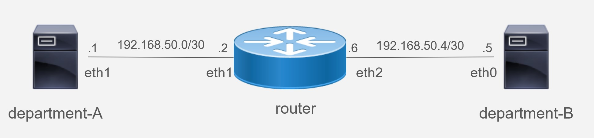

# 問題文

## 概要

とある企業ではネットワーク機能を含めlinuxで構築しており、あなたは`department-A`、及び`router`の管理者である。
ある日、電源トラブルによってサーバ群の再起動が発生したところ、`department-A`から`department-B`に対して通信ができなくなってしまった。  
過去の`router`管理者に確認すると、`department-A`から`department-B`の通信は「IPアドレスを変換」して通信を行っていたようだ。  
あなたには`department-A`から`department-B`へ通信を出来るようにしてほしい。  
また、今後このようなことが起きないように再起動しても通信できるとありがたい。

## ネットワーク図



## 前提条件

* 特になし

## 制約

* `department-A`、及び`router`にログイン可能
* `department-B`にログイン不可
* ネットワークを制御するプロトコルの一部または全ての機能に関する無効化の禁止

## 初期状態

* `department-A`と`router`間のpingによる通信が可能
  * 表示例 ※`X.XXX`、及び`XXXX` の`X`には0~9の数字

    ```
    [user@department-A ~]$ ping 192.168.50.2 -I 192.168.50.1 -c 5
    PING 192.168.50.2 (192.168.50.2) from 192.168.50.1 : 56(84) bytes of data.
    64 bytes from 192.168.50.2: icmp_seq=1 ttl=64 time=X.XXX ms
    64 bytes from 192.168.50.2: icmp_seq=2 ttl=64 time=X.XXX ms
    64 bytes from 192.168.50.2: icmp_seq=3 ttl=64 time=X.XXX ms
    64 bytes from 192.168.50.2: icmp_seq=4 ttl=64 time=X.XXX ms
    64 bytes from 192.168.50.2: icmp_seq=5 ttl=64 time=X.XXX ms

    --- 192.168.50.2 ping statistics ---
    5 packets transmitted, 5 received, 0% packet loss, time XXXXms
    rtt min/avg/max/mdev = X.XXX/X.XXX/X.XXX/X.XXX ms
    ```

* routerとdepartment-B間のpingによる通信が可能
  * 表示例 ※`X.XXX`、及び`XXXX` の`X`には0~9の数字

    ```
    [user@router ~]$ ping 192.168.50.5 -I 192.168.50.6 -c 5
    PING 192.168.50.5 (192.168.50.5) from 192.168.50.6 : 56(84) bytes of data.
    64 bytes from 192.168.50.5: icmp_seq=1 ttl=64 time=X.XXX ms
    64 bytes from 192.168.50.5: icmp_seq=2 ttl=64 time=X.XXX ms
    64 bytes from 192.168.50.5: icmp_seq=3 ttl=64 time=X.XXX ms
    64 bytes from 192.168.50.5: icmp_seq=4 ttl=64 time=X.XXX ms
    64 bytes from 192.168.50.5: icmp_seq=5 ttl=64 time=X.XXX ms

    --- 192.168.50.5 ping statistics ---
    5 packets transmitted, 5 received, 0% packet loss, time XXXXms
    rtt min/avg/max/mdev = X.XXX/X.XXX/X.XXX/X.XXX ms
    ```

## 終了状態

  `department-A`から`department-B`へping通信が可能

* 表示例 ※`X.XXX`、及び`XXXX` の`X`には0~9の数字

    ```
    [user@department-A ~]$ ping 192.168.50.5 -I 192.168.50.1 -c 5
    PING 192.168.50.5 (192.168.50.5) from 192.168.50.1 : 56(84) bytes of data.
    64 bytes from 192.168.50.5: icmp_seq=1 ttl=63 time=X.XXX ms
    64 bytes from 192.168.50.5: icmp_seq=2 ttl=63 time=X.XXX ms
    64 bytes from 192.168.50.5: icmp_seq=3 ttl=63 time=X.XXX ms
    64 bytes from 192.168.50.5: icmp_seq=4 ttl=63 time=X.XXX ms
    64 bytes from 192.168.50.5: icmp_seq=5 ttl=63 time=X.XXX ms

    --- 192.168.50.5 ping statistics ---
    5 packets transmitted, 5 received, 0% packet loss, time XXXXms
    rtt min/avg/max/mdev = X.XXX/X.XXX/X.XXX/X.XXX ms
    ```

# 解説

## トラブルの原因
本問題では`department-A`、`router`内の設定が抜けており、`department-A`から`department-B`へping通信ができない状態になっていました。

抜けている設定は下記のとおりです。
1. `department-A`のルート情報
1. `router`のアドレス変換設定(NAPT or NAT)

以下が初期状態となります。
* `department-A`と`router`間のpingによる通信が可能
  * 表示例 ※`X.XXX`、及び`XXXX` の`X`には0~9の数字
    ```
    [user@department-A ~]$ ping 192.168.50.2 -I 192.168.50.1 -c 5
    PING 192.168.50.2 (192.168.50.2) from 192.168.50.1 : 56(84) bytes of data.
    64 bytes from 192.168.50.2: icmp_seq=1 ttl=64 time=X.XXX ms
    64 bytes from 192.168.50.2: icmp_seq=2 ttl=64 time=X.XXX ms
    64 bytes from 192.168.50.2: icmp_seq=3 ttl=64 time=X.XXX ms
    64 bytes from 192.168.50.2: icmp_seq=4 ttl=64 time=X.XXX ms
    64 bytes from 192.168.50.2: icmp_seq=5 ttl=64 time=X.XXX ms

    --- 192.168.50.2 ping statistics ---
    5 packets transmitted, 5 received, 0% packet loss, time XXXXms
    rtt min/avg/max/mdev = X.XXX/X.XXX/X.XXX/X.XXX ms
    ```
* `router`と`department-B`間のpingによる通信が可能
  * 表示例 ※`X.XXX`、及び`XXXX` の`X`には0~9の数字
    ```
    [user@router ~]$ ping 192.168.50.5 -I 192.168.50.6 -c 5
    PING 192.168.50.5 (192.168.50.5) from 192.168.50.6 : 56(84) bytes of data.
    64 bytes from 192.168.50.5: icmp_seq=1 ttl=64 time=X.XXX ms
    64 bytes from 192.168.50.5: icmp_seq=2 ttl=64 time=X.XXX ms
    64 bytes from 192.168.50.5: icmp_seq=3 ttl=64 time=X.XXX ms
    64 bytes from 192.168.50.5: icmp_seq=4 ttl=64 time=X.XXX ms
    64 bytes from 192.168.50.5: icmp_seq=5 ttl=64 time=X.XXX ms

    --- 192.168.50.5 ping statistics ---
    5 packets transmitted, 5 received, 0% packet loss, time XXXXms
    rtt min/avg/max/mdev = X.XXX/X.XXX/X.XXX/X.XXX ms
    ```

* 問題参加者から確認できない`department-B`を含めたルート情報
  * `department-A`
    ```
    [user@department-A ~]$ ip route show
    192.168.50.0/30 dev eth1 proto kernel scope link src 192.168.50.1 metric 101
    192.168.100.0/24 via 192.168.255.254 dev eth0 proto static metric 100
    192.168.255.0/24 dev eth0 proto kernel scope link src 192.168.255.50 metric 100
    ```
  * `router`
    ```
    [user@router ~]$ ip route show
    192.168.50.0/30 dev eth1 proto kernel scope link src 192.168.50.2 metric 101
    192.168.50.4/30 dev eth2 proto kernel scope link src 192.168.50.6 metric 102
    192.168.100.0/24 via 192.168.255.254 dev eth0 proto static metric 100
    192.168.255.0/24 dev eth0 proto kernel scope link src 192.168.255.51 metric 100
    ```

  * `department-B`
    ```
    [user@department-B ~]$ ip route show
    192.168.50.4/30 dev eth0 proto kernel scope link src 192.168.50.5 metric 100
    ```

* `router`のNAPT設定に関する情報
  * コマンド
    ```
    [user@router ~]$ sudo firewall-cmd --list-all --zone=develop-external | grep masquerade
      masquerade: no
    ```

## 原因の解決策
ここでは下記の2つの設定変更での解決策を紹介します。
1. `department-A`のルート情報の追加
1. `router`のNAPT機能の有効化

`department-A`のルート情報の追加は下記のように実施します。
   ```
    [user@department-A ~]$ sudo ip route add 192.168.50.4/30 via 192.168.50.2
   ```

`router`のNAPT機能の有効化は下記のように実施します。
  ```
  [user@router ~]$ sudo firewall-cmd --zone=develop-external --add-masquerade
  ```

上記により、基準点となる`department-A`から`department-B`へping通信が可能となります。
また、満点をとるためには問題文にある通り、「再起動しても通信できる」必要があります。
再起動を考慮する場合、ルート情報の追加は「mntui」等を用い、static経路の設定が有効となります。
加えて、`router`のNAPT機能の有効化は`sudo firewall-cmd --zone=develop-external --permanent` を追加する必要があります。
もちろん、上記コマンドと前述したNAPT設定を組み合わせ`sudo firewall-cmd --zone=develop-external --add-masquerade  --permanent`としても問題ありません。

本問題は再起動前の経路確認及びpingの結果、
再起動後のpingによる結果のみで採点しているため、iptablesなどを使う方法など様々な解決方法があります。

## 解決後の状態確認コマンド・結果
* department-A のip route show
  ```
  [user@department-A ~]$ ip route show
  192.168.50.0/30 dev eth1 proto kernel scope link src 192.168.50.1 metric 101
  192.168.50.4/30 via 192.168.50.2 dev eth1
  192.168.100.0/24 via 192.168.255.254 dev eth0 proto static metric 100
  192.168.255.0/24 dev eth0 proto kernel scope link src 192.168.255.50 metric 100
  ```
* routerのNAPT設定に関する
  ```
  [user@router ~]$ sudo firewall-cmd --list-all --zone=develop-external | grep masquerade
    masquerade: yes
  ```

## 採点基準
* 再起動前にdepartment-Aの経路を追加していること: 10点
* 再起動前にping送信用のdepartment-Aから宛先のdepartment-Bにpingが飛ぶこと：+30点
* 再起動後にも設定が保持できており、 department-A から department-B へping通信可能：+10点
  * 想定: nmtuiによるネットワーク設定, firewall-cmdの--permanent など
