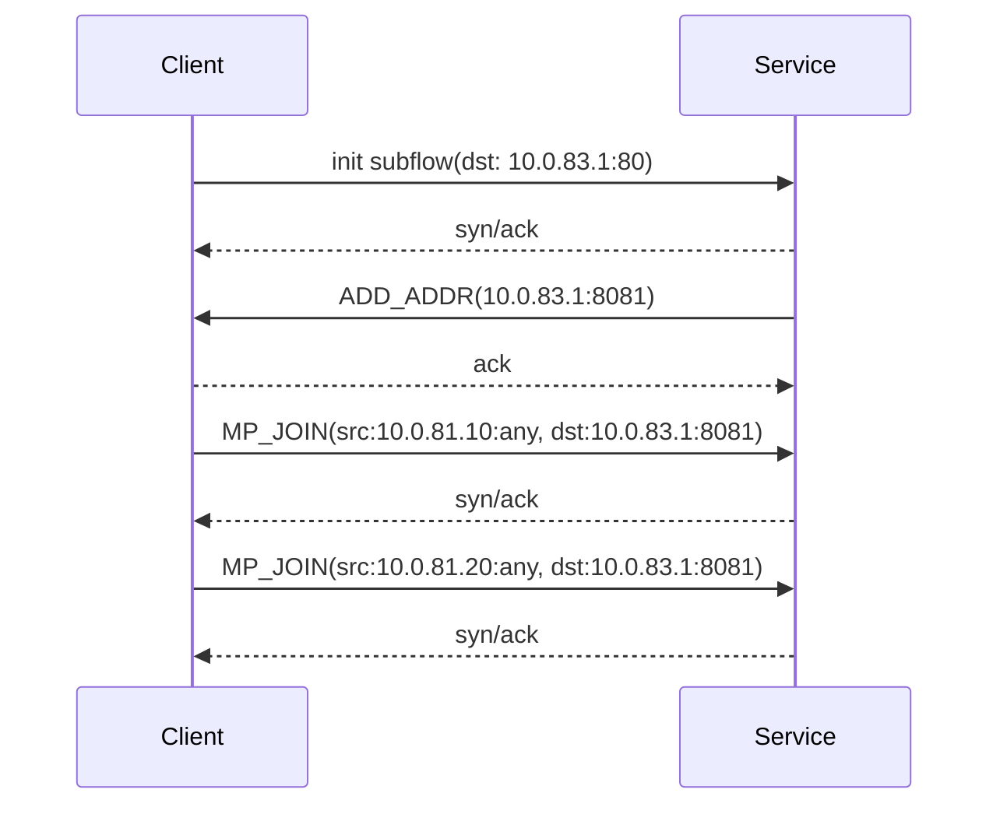
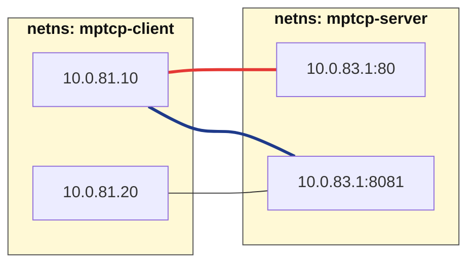
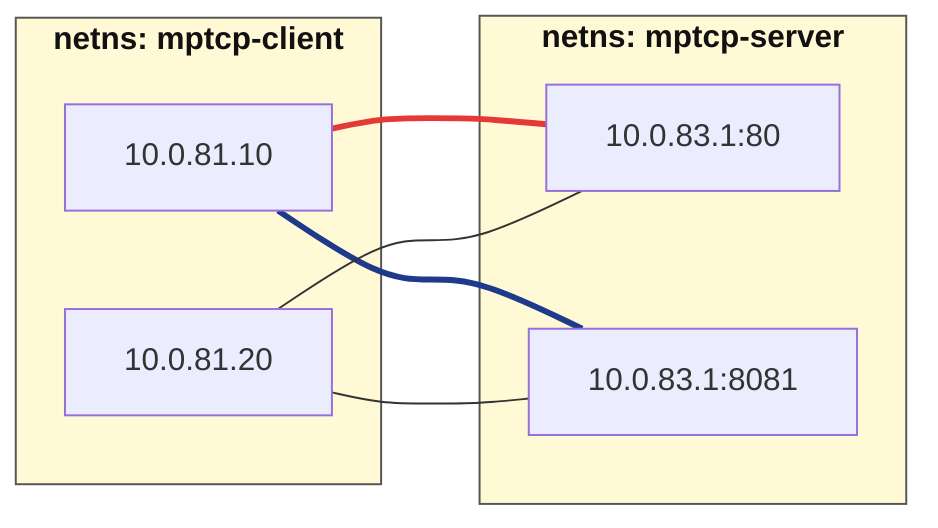

## 概要

あなたはIPぽくぽくNetworksでR&Dを担当するリードエンジニアです。

隣のチームが新サービスのPoCを実施していましたが、担当者の急な休職により、あなたのチームが引き継ぐことになりました。作業メモによると、モバイルアプリケーションの体験向上のためにマルチパス技術を利用しており、セルラーとWi-Fiの2つのWANを束ね、どちらかが切断されても通信を継続できる構成になっていたようです。

PoCは以前は正常に動作していましたが、引き継ぎ後に環境が古い状態に戻され、一部の機能が壊れてしまいました。部下の話によると「以前はMPTCPで複数のサブフローを確立できていた」とのことです。あなたはこのネットワークを正しく復旧させ、再び利用可能な状態にする必要があります。

## 前提条件

環境は2台のサーバーで構成されています。
server-01上ではnetnsを利用して複数のネットワーク名前空間が作られています。

```shell
$ ip netns
app-2 (id: 3)
app-1 (id: 2)
LB (id: 1)
Router (id: 0)
```

ネットワーク名前空間へアクセスする際は以下のように実行します。

```shell
ip netns exec app-1 bash
```

ネットワークの作成や削除はsystemdを経由して行われます。

```shell
# create: /usr/local/sbin/setup_lab_net.sh
sudo systemctl start setup-lab-net

# destroy: /usr/local/sbin/cleanup_lab_net.sh
sudo systemctl stop setup-lab-net
```

スクリプトは `/usr/local/sbin/setup_lab_net.sh` および `/usr/local/sbin/cleanup_lab_net.sh` に記述されており、これを改変することで簡単に再構築できます。

### ネットワーク図

トポロジーは指定の図のとおりで、変更してはいけません。


## 初期状態

VIPに向けてクライアントから接続を試みても通信できません。

```shell
client -addr "10.0.83.1:80"
```

## 終了状態

- clientコマンドでVIP 10.0.83.1:80 に接続できること
- ip mptcp monitorで、初回フローのdaddrが10.0.83.1、dportが80であること
- 追加サブフローのdaddrが10.0.83.1で統一され、dportが同一であること
  - dportは8081または8082のいずれかで統一されていれば可
- 追加サブフローが複数インターフェースから確立されること
- app-1, app-2が同時に動いていること

### 参考情報

サンプルの自作のサーバークライアントアプリケーションが動いており、それらはclientコマンド経由で入力したテキストデータをEchoすることが出来ます。

```shell
user@client-01:~$ client -addr "10.0.83.1:80"
connected to 10.0.83.1:80 with mptcp: true
entering interactive mode; type messages and press Enter to send
press Ctrl+D (EOF) to exit
--------------------------------------------------------
hello!
recv> hello!
world!
recv> world!
```

以下のコマンドを使ってマルチパスが動いていることを確認してください。
sportは任意の値で構いませんが、daddrやdport（または8082でも可）に関しては同一になることを意識してもらう必要があります。

```shell
user@client-01:~$ sudo ip mptcp monitor
[        CLOSED] token=404bec1a
[       CREATED] token=230f8c8e remid=0 locid=0 saddr4=10.0.81.10 daddr4=10.0.83.1 sport=36682 dport=80
[   ESTABLISHED] token=230f8c8e remid=0 locid=0 saddr4=10.0.81.10 daddr4=10.0.83.1 sport=36682 dport=80
[     ANNOUNCED] token=230f8c8e remid=1 daddr4=10.0.83.1 dport=8081
[SF_ESTABLISHED] token=230f8c8e remid=1 locid=0 saddr4=10.0.81.10 daddr4=10.0.83.1 sport=49837 dport=8081 backup=0
[SF_ESTABLISHED] token=230f8c8e remid=1 locid=2 saddr4=10.0.82.10 daddr4=10.0.83.1 sport=50051 dport=8081 backup=0 ifindex=4
```

## 接続情報

| ホスト名 | IP アドレス  | ユーザ | パスワード |
| -------- | ------------ | ------ | ---------- |
| client-01  | 192.168.255.81 | user | ictsc2025 |
| server-01  | 192.168.255.82 | user | ictsc2025 |

----

## 解説

`The Handover of the Handover`のタイトルは休職した人の引き継ぎをしたら（人のハンドオーバー）をしたらその仕事がハンドオーバーの検証だったという引っ掛けた意でした。なぜかトラコンの問題は「誰かからトラブルを引き継いでなんとかしてください！」と言う論法でつくられてしまいがちなんですよね...（ﾄﾎﾎ）

ともあれ問題を楽しんでもらえましたでしょうか？楽しんでもらえていたら嬉しいです。以下解答例解説をします。

この課題は、MPTCPの動作を理解し、複数のサブフローを同一のバックエンドサーバーに正しく接続する設定を体験する内容です。MPTCPでは、すべてのサブフローが同じバックエンドサーバーに接続される必要があり、ロードバランサー構成では戻りパケットの扱いが重要になります。

MPTCP自体に不慣れな場合は、筆者の発表資料が参考になります。この解答例ではMPTCPの詳細な構成説明は外部資料に任せて省略します。

cf. [https://speakerdeck.com/takehaya/go-conference-2025-godeti-gan-surumultipath-tcp-go-1-dot-24-shi-dai-no-mptcp-listener-woli-jie-suru](https://speakerdeck.com/takehaya/go-conference-2025-godeti-gan-surumultipath-tcp-go-1-dot-24-shi-dai-no-mptcp-listener-woli-jie-suru)

また、サーバークライアント型の簡易アプリケーションコードは以下にあります。

cf. [https://github.com/takehaya/mptcp_playground/tree/main/cmd](https://github.com/takehaya/mptcp_playground/tree/main/cmd)

本課題のポイントは、「MPTCPのサブフローは常に同一のバックエンドサーバーに接続される必要がある」という要件にあり、ロードバランサーを挟む構成では戻りパケット処理に工夫が必要であることを体験する点にあります。

課題の要点だけ掻い摘むとこの辺がポイントでした。

- ロードバランサーでの戻りパケット処理の工夫が必要であること
  - 単純な転送設定では、VIP宛ての通信を処理する際に、戻りのパケットの送信元アドレスが自分自身（LBのアドレス）になってしまい、通信が破綻します。
  - 通常であればL3DSRのような方式で対応するケースが多いものの、環境の制約上これを実装するのは手間がかかります。多くのシステムでは、L7ロードバランサーが配置されたノード側でこの問題を吸収しますが、本環境では別の方法で解決する必要があります。
  - 結論としては前者の問題をなんとかして無視して解決します。
- MPTCP subflow の設定と制御
  - クライアントからサーバーに対して、add_addrとポート番号を指定して通知を行い、複数の経路（subflow）を確立します。
  - さらに`allow_join_initial_addr_port`を無効化し、明示的に通知されたadd_addrのみを使用してサブフローを形成するよう設定します。
    - 筆者の方針としては、セキュリティの観点からバックエンドサービスを外部に直接公開せず、ロードバランサー配下にのみ配置することを推奨しています。また、マルチNIC構成は運用上の負担が大きいため、LB配下で完結させる設計としています。

これらの設定を正しく行うことで、MPTCPの特性を活かしつつ、LBを介した安定したマルチパス通信を実現できます。

以降は、問題の解き方と最後に入れるべき解答例を提示します。

### 問題の解き方

問題の解き方としては、まず完了条件をよく読むことです。

`以下のコマンドを使ってマルチパスが動いていることを確認してください。`の中身を読んでみます。

```shell
user@client-01:~$ sudo ip mptcp monitor
[        CLOSED] token=404bec1a
[       CREATED] token=230f8c8e remid=0 locid=0 saddr4=10.0.81.10 daddr4=10.0.83.1 sport=36682 dport=80
[   ESTABLISHED] token=230f8c8e remid=0 locid=0 saddr4=10.0.81.10 daddr4=10.0.83.1 sport=36682 dport=80
[     ANNOUNCED] token=230f8c8e remid=1 daddr4=10.0.83.1 dport=8081
[SF_ESTABLISHED] token=230f8c8e remid=1 locid=0 saddr4=10.0.81.10 daddr4=10.0.83.1 sport=49837 dport=8081 backup=0
[SF_ESTABLISHED] token=230f8c8e remid=1 locid=2 saddr4=10.0.82.10 daddr4=10.0.83.1 sport=50051 dport=8081 backup=0 ifindex=4
```

ここを簡単に読み替えるとこのような構成になることを期待していることが分かります。

- init subflow(初回接続)
  - dst: `10.0.83.1:80`
  - src: `10.0.81.10:36682`(但しportは任意で良い)
- subflow1
  - dst: `10.0.83.1:8081`
  - src: `10.0.81.10:49837`(但しportは任意で良い)
- subflow2
  - dst: `10.0.83.1:8081`
  - src: `10.0.82.10:50051`(但しportは任意で良い)

まず別のportにアクセスさせている点をどう実現するかを考えます。
ここは `ANNOUNCED` となってる点を見ると、`daddr4=10.0.83.1 dport=8081` このように書いてあります。つまり何かしらの方法でポートとアドレスの組みをClientに対して広報してくることが可能なことが推察されます。

[rfc8684](https://datatracker.ietf.org/doc/html/rfc8684)を眺めてみると `ADD_ADDR` と言うoptionを使うことで実現しているようです。また、`MP_JOIN` を利用することで初回にできた接続(init subflow) 以外での接続を実現していることが理解できます。

つまりざっくりとしたシーケンスの要点だけを掴むとこのようになるはずです。



つまり、この通信は、ADD_ADDRオプションによってサーバー側がポートとアドレスを広報し、クライアントがMP_JOINでサブフローを確立する仕組みです。

つまり、接続としてはこのような対応づけになれば良いことがわかるはずです。
これをどのようにしたら実現できるの考えましょう。



[ip mptcpのmanページ](https://man7.org/linux/man-pages/man8/ip-mptcp.8.html)を参照すると、クライアント側で制御できる範囲が確認できます。おおまかに言えば、接続アルゴリズムと受け入れ可能なサブフローおよびadd_addrの上限数を設定できます。接続アルゴリズムとしてはfullmeshまたはbackupのいずれかを選択することになります。

どちらの方式を採用しても、クライアント側の設定パラメーターだけでは制御が不十分であり、結果的にすべての経路に対してサブフローを確立してしまいます。fullmesh構成では、意図しない経路まで接続が張られ、想定外のフォワーディングが発生するため、正しくロードバランシングを行うことができません。



ここでサーバー側で使えるパラメーターがないのか調べてみると
[https://docs.kernel.org/networking/mptcp-sysctl.html](https://docs.kernel.org/networking/mptcp-sysctl.html)に `allow_join_initial_addr_port` という変数が存在します。

これは、ロードバランサー経由で確立された初回接続のdaddrおよびdportの組み合わせに対して、追加のサブフローを作成しないよう制御する仕組みです。いわゆるCフラグとも呼ばれるもので、この設定を活用すれば、`10.0.81.20から10.0.83.1:80` への不要なサブフロー生成を防ぐことができます。

これにより、MPTCP構成の全体方針が明確になります。

次の段階として、実際に設定を反映し動作を確認します。ここで注意が必要なのは、VIPアドレスをそのまま設定すると問題が発生する点です。これを回避するため、loopbackインターフェースにVIPを割り当て、不要なARP要求が発生しないよう調整します。

この設定により、リクエストは正常にサーバーへ到達する状態になります。ただし、依然として通信が詰まる場合があります。ロードバランサー側のアプリケーション用インターフェースでtcpdumpを実行して確認すると、戻りパケットが破棄されていることがわかります。
原因は、ローカルIPを送信元とする転送パケットがデフォルトでは許可されていないためです。これを明示的に許可する設定を行うことで、通信を正常化できます。

ここまで対応すれば、MPTCPを利用した通信が問題なく動作することを確認できるはずです。以下に実際の解答例を示します。

### 解答例

以下のコマンドをそれぞれのnodeに対して入力をすることで動作可能です。

#### Client

```shell
# 一度flushしておく
sudo ip mptcp endpoint flush

# それぞれのifaceに対してsubflow追加に使えるようにする。またfullmeshにしておく。
sudo ip mptcp endpoint add 10.0.81.10 dev eth1 subflow fullmesh
sudo ip mptcp endpoint add 10.0.82.10 dev eth2 subflow fullmesh

# 受け入れ可能なsubflowとadd_addrの数の上限緩和をする（ここの値は十分に大きければよしとします）
sudo ip mptcp limits set subflow 2 add_addr_accepted 2
```

#### Server(LB)

```shell
# 通信の流れを調べると戻りパケットで落とされるはずなので、それを確認して対応する
# 対応方法はローカルのIPを送信元とする転送パケットも許可する
sudo ip netns exec LB sysctl -w net.ipv4.conf.all.accept_local=1
sudo ip netns exec LB sysctl -w net.ipv4.conf.veth-lb-rt.accept_local=1
sudo ip netns exec LB sysctl -w net.ipv4.conf.veth-lb-br.accept_local=1
```

#### Server(app-1)

```shell
sudo ip netns exec app-1 ip mptcp endpoint flush

# initで繋ぎに行ったものは使わないでねということにする。
sudo ip netns exec app-1 sysctl -w net.mptcp.allow_join_initial_addr_port=0

# 受け入れ可能なsubflowとadd_addrの数の上限緩和をする（ここの値は十分に大きければよしとします）
sudo ip netns exec app-1 ip mptcp limits set subflow 2 add_addr_accepted 2

# VIPを使うのでbindをするためにloにアドレスを紐づけておく
# 通常、Linuxカーネルは、どのインターフェース宛てのARPリクエストであっても、該当するIPを持っていれば応答してしまいます。
# arp_ignore=1 に設定すると、そのARPリクエストを受け取ったインターフェース上に割り当てられたIPに対してのみ応答するようになります。
# arp_announce=2 に設定すると、そのインターフェースに割り当てられているIPアドレスだけを送信元としてARP要求を送るようになります。
sudo ip netns exec app-1 ip addr add 10.0.83.1 dev lo
sudo ip netns exec app-1 sysctl -w net.ipv4.conf.all.arp_ignore=1
sudo ip netns exec app-1 sysctl -w net.ipv4.conf.all.arp_announce=2

# LBの VIP + 自Backend Server だけに割り当てた Port情報の組みを作って自分だけのSubflow用Portを通知する
sudo ip netns exec app-1 ip mptcp endpoint add 10.0.83.1 dev veth-app1 port 8081 signal
```

#### Server(app-2)

```shell
sudo ip netns exec app-2 sysctl -w net.mptcp.allow_join_initial_addr_port=0
sudo ip netns exec app-2 ip mptcp endpoint flush
sudo ip netns exec app-2 ip mptcp limits set subflow 2 add_addr_accepted 2
sudo ip netns exec app-2 ip addr add 10.0.83.1 dev lo
sudo ip netns exec app-2 sysctl -w net.ipv4.conf.all.arp_ignore=1
sudo ip netns exec app-2 sysctl -w net.ipv4.conf.all.arp_announce=2
# portを8082にしてapp-2と異なるようにしておく
sudo ip netns exec app-2 ip mptcp endpoint add 10.0.83.1 dev veth-app2 port 8082 signal
```

### 点数配分

- 終了状態が期待してる状態での回答で満点
  - APPのARPのケアについて言及で50点
